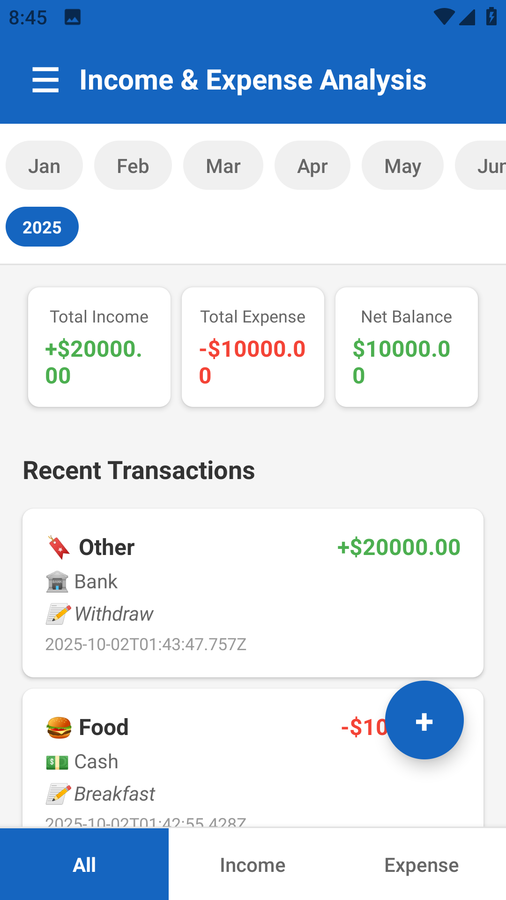
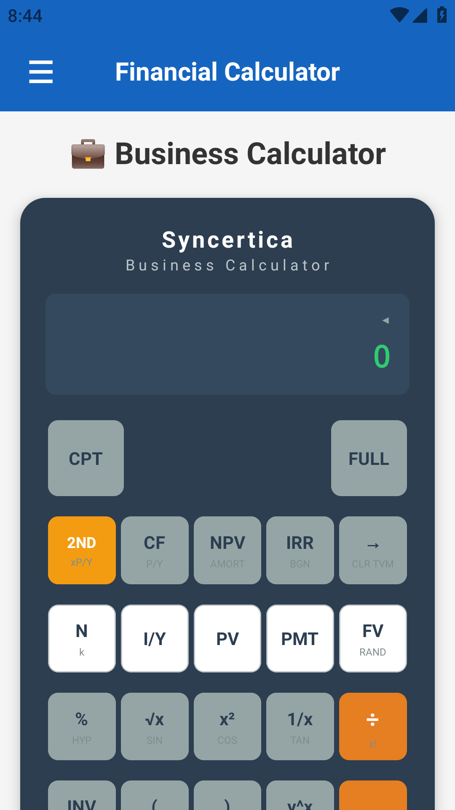

# 📊 Billant - Smart Currency Converter

Billant is a lightweight and user-friendly **Android app** that helps you convert currencies instantly with real-time exchange rates.  
Built for travelers, business professionals, and anyone dealing with multiple currencies daily.  

[](https://play.google.com/store/apps/details?id=com.softgasm.billant&hl=en)

---

## ✨ Features
- 🔄 **Real-Time Currency Conversion** – Powered by [ExchangeRate-API](https://www.exchangerate-api.com/)  
- 🌎 **Supports 160+ Currencies** – Convert between popular and exotic currencies  
- 📱 **Clean & Minimal UI** – Simple, fast, and easy-to-use interface  
- 🚀 **Lightweight** – No unnecessary bloat, optimized for speed  
- 📶 **Works Online** – Always up-to-date exchange rates  

---

## 📸 Screenshots
| Conversion | Currency List |
|------------|---------------|
|  |  |

*(Replace `assets/screenshot1.png` with your actual screenshots in the repo)*

---

## 📥 Installation
Download the app directly from Google Play:

👉 [**Billant on Google Play**](https://play.google.com/store/apps/details?id=com.softgasm.billant&hl=en)

Or clone the repo and build manually:
```bash
git clone https://github.com/<your-username>/Billant.git
```

Open in **Android Studio**, build, and run on your device.

---

## 🛠️ Tech Stack
- **Java (Android)** – Core development language  
- **ExchangeRate-API** – Currency data provider  
- **Gradle** – Build system  

---

## 📌 Roadmap
- [ ] Add offline caching for last used rates  
- [ ] Support for favorite currency pairs  
- [ ] Add dark mode  
- [ ] Widget support for quick conversion  

---

## 🤝 Contributing
Contributions, issues, and feature requests are welcome!  
Feel free to fork the repo and submit a PR.

---

## 📄 License
This project is licensed under the **MIT License** – see the [LICENSE](LICENSE) file for details.

---

### 👨‍💻 Author
Created by **Syncertica**  
💡 Follow for more apps and projects!
